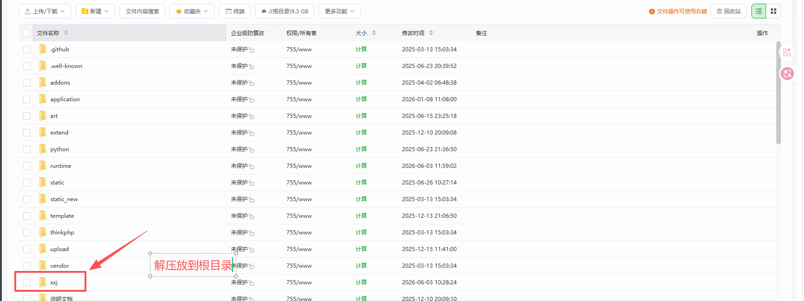
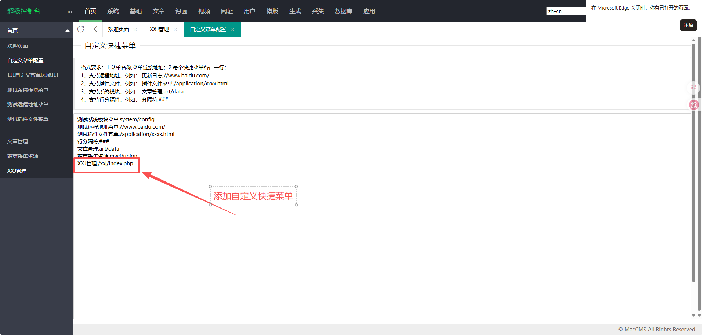
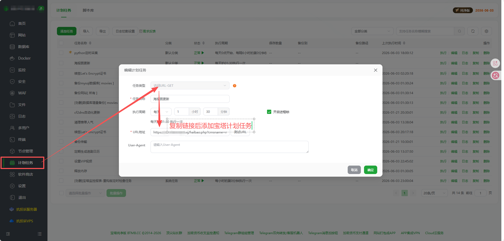

# XXJ - 苹果 CMS 海报轮播图管理插件

XXJ 由 [BBJ](https://baiduc.github.io/pub/bbj/plug/word.html) 二次开发而来。在 BBJ 原有功能基础上，剔除了所有已失效的远程依赖，将数据源切换至 TMDB 开放 API + 猫眼热映数据，实现完全本地化运行。

> **鸣谢 BBJ**：本项目的管理界面（layui 表单）、URL 参数规范和轮播图写入策略均沿用 BBJ 的设计。感谢 BBJ 团队为苹果 CMS 社区提供的开源插件。
>
> BBJ 原项目地址：[https://baiduc.github.io/pub/bbj/plug/word.html](https://baiduc.github.io/pub/bbj/plug/word.html)

## 与 BBJ 的区别

| 维度 | BBJ 原版 | XXJ v3.0 |
|------|----------|----------|
| 数据源 | 远程服务 `bibij.icu` 生成 SQL（已失效） | 猫眼热映 + TMDB API + 本地数据库，三种独立数据源 |
| 海报图源 | 远程服务返回图片 URL | TMDB CDN (`image.tmdb.org`)，16:9 横幅图 |
| 代码执行 | `eval(远程 PHP)` | 纯本地 PHP，无 `eval`、无远程代码拉取 |
| 降级能力 | 无 | 外部 API 不可用时自动回退到本地数据库排序 |
| 管理界面 | 远程拉取 `index.html` | 本地化 `index.html`，不再做远程同步 |
| 安全 | 远程 SQL 直接执行（无预编译） | 全部 `mysqli::prepare` + `bind_param` 预编译 |

## 功能

- **三种更新模式，数据源完全独立**：
  - **最热**：猫眼热映榜单 → 本地匹配 → TMDB 搜图；降级到本地热度排序
  - **最新**：本地数据库按入库时间倒序 → TMDB 搜图；降级只更新推荐等级
  - **最高分**：TMDB 高分榜 → 本地匹配，直接用 TMDB 返回的横图；降级到本地评分排序
- 匹配不足时自动翻页补齐（可关闭）
- 16:9 横幅图（backdrop）适配轮播图区域
- 1 小时文件缓存，减少外部 API 调用
- 完全本地化，无任何外部代码执行依赖
- URL 参数与原 BBJ 插件完全兼容（`even` 自动映射为 `top`）

## 文件说明

```
xxj/
├── haibao.php                # 海报更新入口（核心业务）
├── haibao_config.php         # TMDB 凭证与运行参数配置（需自行创建）
├── haibao_config.example.php # 配置文件模板
├── index.php                 # 管理界面入口
├── index.html                # 管理界面（layui 表单）
├── pinglun.php               # 评论入口（已禁用）
├── clear.php                 # 缓存清理工具
├── 使用教程.txt               # 安装使用说明
├── cache/                    # 文件缓存目录（运行时自动创建）
└── .gitignore                # 忽略凭证与缓存
```

## 安装

### 1. 申请 TMDB API Key

前往 [https://www.themoviedb.org/settings/api](https://www.themoviedb.org/settings/api) 注册并申请 API Key（v3 auth）。

### 2. 创建配置文件

复制 `haibao_config.example.php` 为 `haibao_config.php`，填入你的 TMDB API Key：

```php
<?php
if (!defined('BBJ_INCLUDED')) {
    http_response_code(403);
    die('Forbidden');
}

return [
    'tmdb_v3_key'         => '你的TMDB_API_KEY',  // 必填
    'tmdb_lang'           => 'zh-CN',             // 接口语言
    'tmdb_region'         => 'HK',                // 地区
    'image_field'         => 'backdrop',          // poster(2:3竖图) 或 backdrop(16:9横图)
    'image_size'          => 'w500',              // poster 尺寸：w185/w342/w500/original
    'backdrop_size'       => 'w1280',             // backdrop 尺寸：w300/w780/w1280/original
    'num_max'             => 20,                  // 轮播图最大张数
    'cache_ttl'           => 3600,                // 缓存秒数（默认1小时）
    'db_table'            => 'mac_vod',           // 数据库表名
    'slide_sep'           => '|',                 // 轮播图字段分隔符（兼容保留）
    'maoyan_enabled'      => true,                // 是否启用猫眼数据源（hot 模式）
    'maoyan_timeout'      => 8,                   // 猫眼 API 超时秒数
    'tmdb_search_timeout' => 5,                   // TMDB 搜索 API 超时秒数
];
```

### 3. 上传到苹果 CMS

将 `xxj/` 目录上传至站点根目录：



```
/www/wwwroot/your-site/
└── xxj/
    ├── haibao.php
    ├── haibao_config.php
    ├── index.php
    ├── index.html
    ├── pinglun.php
    ├── clear.php
    └── 使用教程.txt
```

### 4. 添加后台菜单

在苹果 CMS 后台添加自定义菜单：

```
XXJ管理,/xxj/index.php
```



## 使用

### 管理界面

访问 `https://你的域名/xxj/index.php`，在表单中选择参数后点击「获取代码」，复制生成的链接。

### URL 参数

| 参数 | 取值 | 默认 | 说明 |
|------|------|------|------|
| `bbjtype` | `hot` / `new` / `top` / `even` | `hot` | 更新模式。hot=最热，new=最新，top=最高分，even=兼容旧版（等同 top） |
| `autofill` | `on` / `off` | `on` | 匹配不足时自动翻页补齐 |
| `num` | 1-20 整数 | 10 | 轮播图张数 |
| `level` | 1-9 整数 | 9 | 推荐等级（需与模板对应） |
| `orderby` | `ASC` / `DESC` | `ASC` | 同名多部时的选取顺序。ASC=取最近一次，DESC=取第一次 |
| `cmsname` | 任意字符串 | - | 兼容原插件参数，内部忽略 |
| `codetype` | 任意字符串 | - | 兼容原插件参数，内部忽略 |
| `filtercondi` | 任意字符串 | - | 兼容原插件参数，内部忽略 |

### 示例链接

```
# 最热影片，10张，推荐等级9，自动补齐
https://你的域名/xxj/haibao.php?bbjtype=hot&num=10&level=9&autofill=on&cmsname=maccms10&codetype=php

# 最新入库，6张
https://你的域名/xxj/haibao.php?bbjtype=new&num=6&level=9

# 最高分，8张，推荐等级5，不自动补齐
https://你的域名/xxj/haibao.php?bbjtype=top&num=8&level=5&autofill=off
```

## 定时自动更新（宝塔任务计划）




## 清除缓存

访问 `https://你的域名/xxj/clear.php` 清空缓存目录，下次访问将重新从数据源拉取。

## 三种模式详细说明

### hot（最热）

从猫眼热映榜获取当前正在上映的影片列表，在本地 `mac_vod` 表中按 `vod_name` 精确匹配，匹配到的影片再去 TMDB 搜索获取 16:9 横图。

**降级**：猫眼 API 不可用时，自动切换为本地 `mac_vod` 按 `vod_hits`（播放量）倒序排列。

### new（最新）

直接从本地 `mac_vod` 表按 `vod_time`（入库时间）倒序取最新影片，无外部列表依赖。逐条去 TMDB 搜索获取横图。

**降级**：TMDB 搜索不可用时，仅更新 `vod_level`（推荐等级），保持原图不变。

### top（最高分）

从 TMDB `movie/top_rated` 获取高分影片列表，在本地 `mac_vod` 中匹配。匹配到的影片直接使用 TMDB 返回的 `backdrop_path`，无需二次搜索。

**降级**：TMDB 不可用时，自动切换为本地 `mac_vod` 按 `vod_score`（评分）倒序排列。

## 匹配机制

所有模式均在本地数据库 `mac_vod` 表中按 `vod_name` 精确匹配：

- 匹配成功 → UPDATE 该影片的 `vod_pic_slide`（海报图 URL）和 `vod_level`（推荐等级）
- 匹配失败 → 跳过，`autofill=on` 时继续取下一条直到凑够数量
- 同名多部 → 按 `orderby` 参数决定取最近还是最早添加的记录

模板标签 `{maccms:vod level="9"}` 自动读取这些数据展示轮播图。

## 模板适配

默认主题轮播图模板标签：

```html
{maccms:vod level="9" num="6" by="time" order="desc"}
<a class="swiper-slide" href="{$vo|mac_url_vod_detail}"
   data-background="{$vo.vod_pic_slide|mac_url_img}"
   title="{$vo.vod_name}">
{/maccms}
```

`level` 值需与插件配置中的 `level` 参数一致。如模板使用 `level="9"`，插件默认 `level=9` 即可。

## 注意事项

- TMDB API 限制 40 请求/10 秒，插件内置 250ms 请求间隔 + 1 小时缓存，正常使用不会触发限流
- 猫眼 API 为非官方接口，如遇封禁可在配置中设置 `maoyan_enabled => false` 关闭
- 首次使用需清除苹果 CMS 后台缓存后才能在首页看到更新
